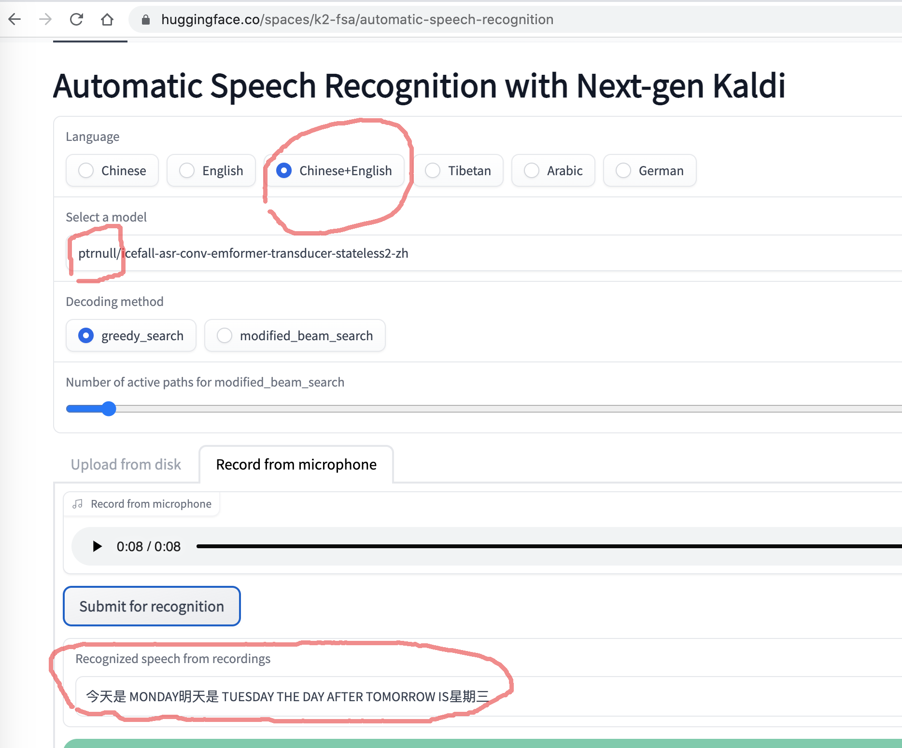

# Introduction

This repo contains models for speech recognition in ncnn format,
which is converted from
<https://huggingface.co/ptrnull/icefall-asr-conv-emformer-transducer-stateless2-zh>.

Please see
<https://github.com/k2-fsa/sherpa-ncnn>
for usage.

It supports both English as well as Chinese. That is, you can have
both English and Chinese in a single utterance.

Please visit <https://huggingface.co/spaces/k2-fsa/automatic-speech-recognition>
to try the model in your browser without installing anything.

